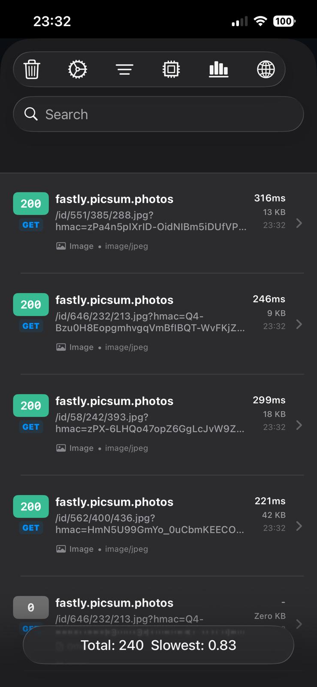
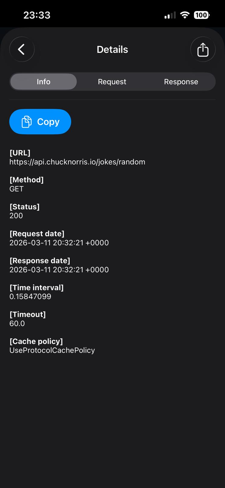
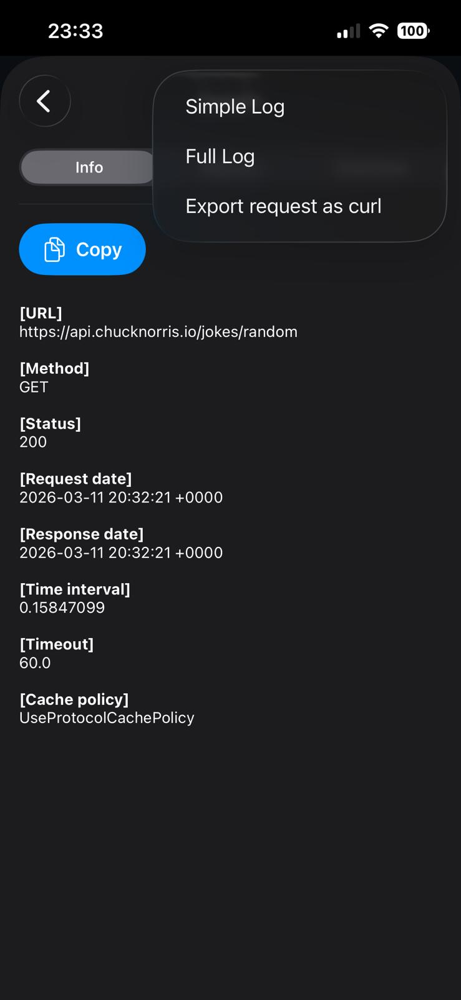
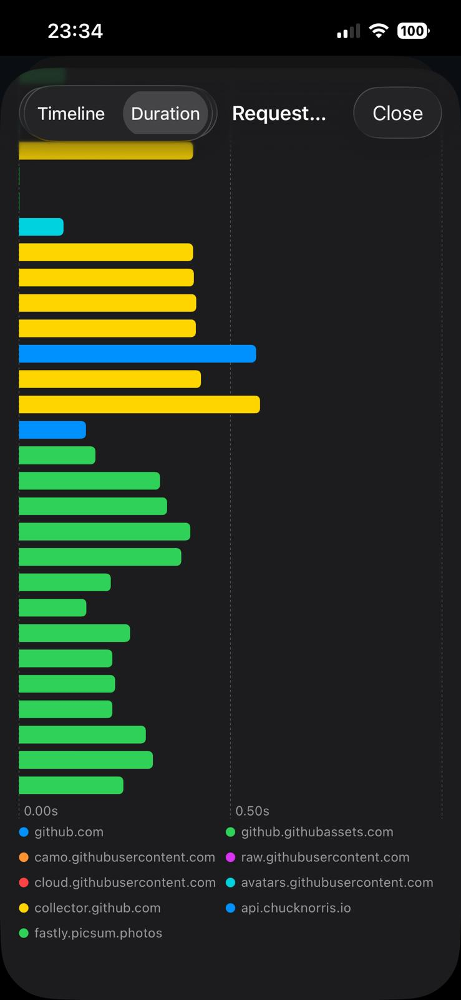
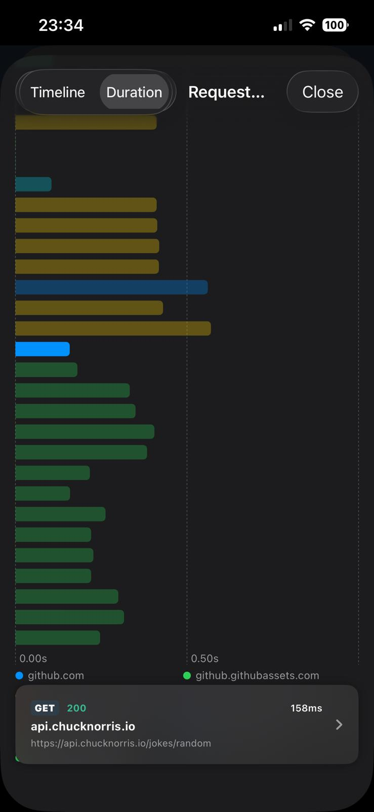
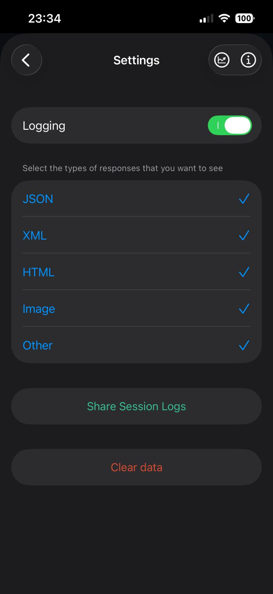
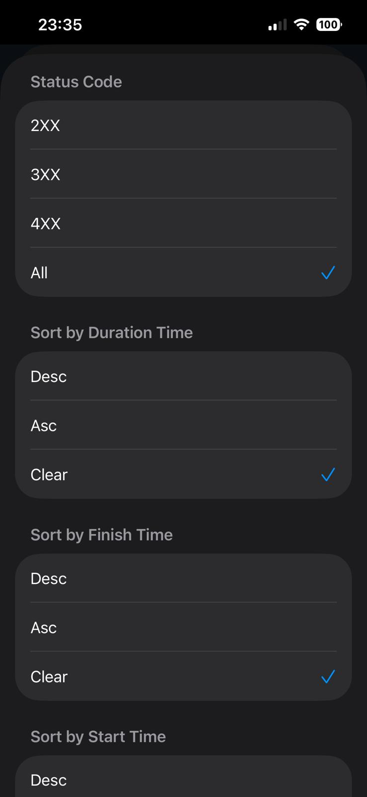
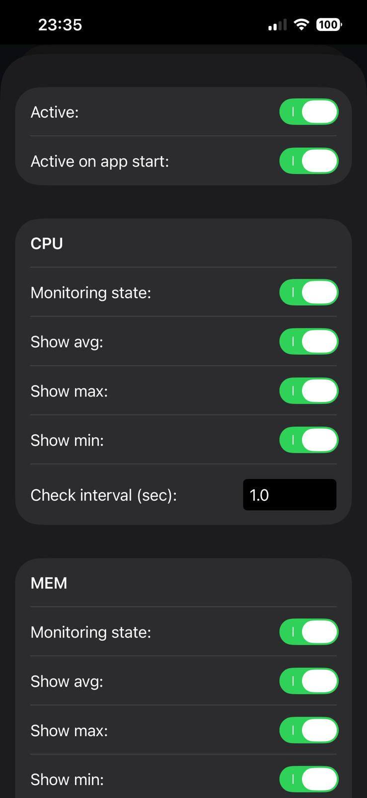
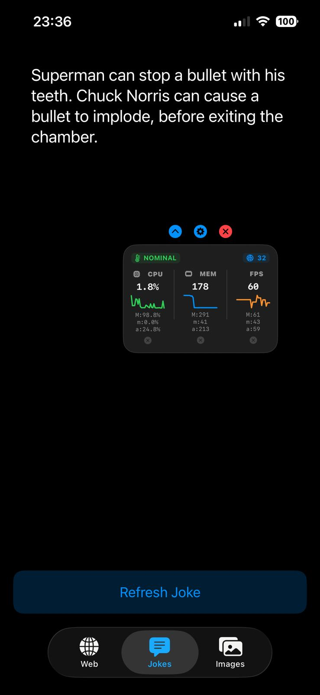

# netfox · SwiftUI Edition

> **A lightweight, one-line-setup iOS network debugging library — now fully rebuilt in SwiftUI with a real-time performance monitor.**

netfox automatically intercepts every HTTP/HTTPS request your app makes (including requests from third-party SDKs, `UIWebView`s, and `WKWebView`s) and presents them in a beautiful, searchable, filterable inspector UI that you summon with a shake or a single API call.

This fork replaces the original UIKit interface with a **100 % SwiftUI** implementation and adds several new capabilities not found in the original library.

---

## Table of Contents

- [Screenshots](#screenshots)
- [Features](#features)
  - [Core / Original Features](#core--original-features)
  - [New Features in the SwiftUI Edition](#new-features-in-the-swiftui-edition)
- [Requirements](#requirements)
- [Installation](#installation)
  - [Swift Package Manager](#swift-package-manager)
  - [CocoaPods](#cocoapods)
  - [Manual](#manual)
- [Setup — One Line](#setup--one-line)
- [Usage](#usage)
  - [Show / Hide the Inspector](#show--hide-the-inspector)
  - [Gesture Configuration](#gesture-configuration)
  - [URL Filtering](#url-filtering)
  - [Cache Policy](#cache-policy)
  - [Session Logs](#session-logs)
  - [Performance Monitor Widget](#performance-monitor-widget)
- [UI Walkthrough](#ui-walkthrough)
  - [Request List](#request-list)
  - [Request Details](#request-details)
  - [Filters](#filters)
  - [Charts](#charts)
  - [Statistics](#statistics)
  - [Settings](#settings)
  - [Performance Monitor](#performance-monitor)
  - [Performance Monitor Settings](#performance-monitor-settings)
- [Configuration Reference](#configuration-reference)
- [Localization](#localization)
- [Architecture Notes](#architecture-notes)
- [License](#license)

---

## Screenshots

<div style="display:flex; overflow-x:auto; gap:10px;">
  
  
  
  
  
  
  
  
  
</div>
---

## Features

### Core / Original Features

These features existed in the original [netfox](https://github.com/kasketis/netfox) library and are fully preserved:

- **Zero-config interception** — registers a custom `URLProtocol` (`NFXProtocol`) that captures every `URLSession` request automatically, including requests from third-party networking libraries.
- **Request List** — scrollable, paginated list of all captured HTTP transactions with method badge, status code, host, path, and timing at a glance.
- **Request Details** — three-tab inspector (Info / Request / Response) showing every header, body, URL, method, status, dates, duration, timeout, and cache policy.
- **Shake to open** — shake the device to reveal the inspector. No buttons or gestures needed in your own UI.
- **Custom gesture** — set `.custom` gesture mode and call `NFX.sharedInstance().show()` / `hide()` / `toggle()` from your own code.
- **URL ignore list (exact)** — hide specific URLs from the capture list.
- **URL ignore list (regex)** — hide URLs matching a regular expression pattern.
- **Response type filter** — choose which content types (JSON, XML, HTML, Image, …) appear in the list.
- **Enable / Disable logging at runtime** — toggle capture on or off without restarting.
- **Clear data** — wipe all captured traffic with a confirmation dialog.
- **Share session log** — export the full plain-text session log file via the system share sheet.
- **Cache policy toggle** — control whether netfox's internal `URLCache` stores responses (`notAllowed` by default).
- **Automatic JSON pretty-printing** — response and request bodies containing JSON are automatically formatted for readability.
- **Image body viewer** — image response bodies are rendered inline.
- **Large body viewer** — bodies larger than 1 KB are presented in a dedicated detail screen rather than inline, keeping the main detail view snappy.
- **cURL export** — every request includes a ready-to-paste `curl` command.

### New Features in the SwiftUI Edition

These features are unique to this fork and are **not** present in the original library:

#### 🔍 Advanced Filtering & Sorting
- **Status code filter** — filter the list to show only *Success* (2xx), *Redirect* (3xx), *Error* (4xx/5xx), or *All* requests via a dedicated Filter sheet.
- **Sort by duration** — sort requests ascending or descending by response duration.
- **Sort by start time** — sort requests ascending or descending by request start timestamp.
- **Sort by finish time** — sort requests ascending or descending by response finish timestamp.
- **Domain ignore list** — per-session domain muting: open the Filter sheet, search domains, and tap to toggle them. Ignored domains are persisted across inspector opens within the session.
- **Quick domain filter** — a toolbar Globe menu lets you instantly filter the list to a single domain. An ✕ button clears it.

#### 📊 Request Chart View
- **Timeline chart** — horizontal bar chart showing each request as a segment on a shared time axis, color-coded by host domain.
- **Duration chart** — horizontal bar chart sorted by response duration for quick bottleneck identification.
- **Interactive selection** — tap a bar to reveal a floating info card with method, status, host, URL, and duration; card links to the full detail screen.
- **Legend** — color-coded legend at the bottom identifies each host.

#### 📈 Statistics View
- Total, successful, and failed request counts.
- Total and average request body size (KB).
- Total and average response body size (KB).
- Average, fastest, and slowest response times (seconds).
- Live — statistics update automatically as new requests arrive.

#### 📋 Copy Button
- Every detail tab (Info, Request, Response) has a **Copy** button that copies the entire tab content to the clipboard with haptic feedback and an animated confirmation ("Copied!").

#### 🖥️ Performance Monitor Widget (`PerformanceMonitoringView`)
A draggable, floating overlay widget you can embed in your own app's view hierarchy during development:

- **CPU usage** — real-time CPU percentage with configurable polling interval.
- **Memory usage** — live resident memory in MB with configurable polling interval.
- **FPS** — frames per second via a `CADisplayLink`-based monitor.
- **Sparkline graphs** — mini line charts showing the last 30 readings for each metric.
- **Max / Min / Avg statistics** — per-metric statistics shown below the sparkline; each can be enabled/disabled individually. Tap the ✕ button next to a metric to reset its stats.
- **Thermal state indicator** — color-coded badge (NOMINAL → FAIR → SERIOUS → CRITICAL) reflecting `ProcessInfo.thermalState`.
- **Active request counter** — live count of in-flight network requests, integrated with the NFX model manager.
- **Draggable positioning** — drag the widget anywhere on screen; position persists as long as the view is alive.
- **Collapse modes** — collapse vertically (hides sparklines, stats, and thermal info) or collapse horizontally (hides metric labels) via control buttons at the top.
- **Quick-open netfox** — gear button on the widget opens the netfox request inspector directly.
- **Preview mode** — pass `isPreviewMode: true` to display the widget statically in the Performance Settings sheet without control buttons or drag behavior.

#### ⚙️ Performance Monitor Settings (`PerformanceMonitoringSettingsView`)
A dedicated settings sheet (accessible via the 📡 toolbar button in the request list) where you can:

- Enable/disable the floating performance widget globally.
- Enable "Active on app start" to show the widget automatically when the app launches.
- Configure each metric (CPU, MEM, FPS) independently:
  - Toggle monitoring on/off.
  - Toggle individual Max / Min / Avg display.
  - Set check interval in seconds (text field).
- Toggle vertical and horizontal collapse modes.
- Preview the widget live at the bottom of the settings sheet.

All settings are **persisted** in `UserDefaults` using the `"netfox"` suite and restored on next launch.

#### 🌍 Localization
All UI strings are fully localized. The library ships with an `en.lproj/Localizable.strings` file and supports adding additional languages without code changes.

---

## Requirements

| | Minimum |
|---|---|
| iOS | 17.0 |
| Swift | 5.0 |
| Xcode | 15.0+ |

> **Important:** Only use netfox in `DEBUG` builds. See [Setup](#setup--one-line) for the recommended conditional compilation pattern.

---

## Installation

### Swift Package Manager

1. In Xcode, go to **File → Add Package Dependencies…**
2. Enter the repository URL:
   ```
   https://github.com/alisefaalparslan/netfox-SwiftUI
   ```
3. Choose **Up to Next Major Version** from `2.5.0`.
4. Add the `netfox` library to your app target.

Or add it directly to your `Package.swift`:

```swift
dependencies: [
    .package(url: "https://github.com/alisefaalparslan/netfox-SwiftUI.git", from: "2.5.0")
],
targets: [
    .target(
        name: "YourApp",
        dependencies: ["netfox"]
    )
]
```

### Manual

1. Clone or download this repository.
2. Drag the entire `netfox/` folder into your Xcode project.
3. Make sure **Copy items if needed** is checked and the files are added to your app target.

---

## Setup — One Line

### Swift (AppDelegate)

```swift
import netfox

func application(_ application: UIApplication,
                 didFinishLaunchingWithOptions launchOptions: [UIApplication.LaunchOptionsKey: Any]?) -> Bool {
    #if DEBUG
    NFX.sharedInstance().start()
    #endif
    return true
}
```

### Swift (SwiftUI App entry point)

```swift
import SwiftUI
import netfox

@main
struct MyApp: App {
    init() {
        #if DEBUG
        NFX.sharedInstance().start()
        #endif
    }

    var body: some Scene {
        WindowGroup {
            ContentView()
        }
    }
}
```

## Usage

### Show / Hide the Inspector

```swift
// Show programmatically
NFX.sharedInstance().show()

// Show on a specific view controller (useful for SwiftUI window scenes)
NFX.sharedInstance().show(on: myViewController)

// Hide
NFX.sharedInstance().hide()

// Toggle (show if hidden, hide if visible)
NFX.sharedInstance().toggle()
```

### Gesture Configuration

By default, **shaking** the device opens the inspector.

```swift
// Keep default shake gesture (default)
NFX.sharedInstance().setGesture(.shake)

// Disable the built-in gesture; you manage show/hide yourself
NFX.sharedInstance().setGesture(.custom)
```

**Custom gesture example — button in your UI:**

```swift
Button("Open Network Inspector") {
    NFX.sharedInstance().show()
}
```

**Custom gesture example — swipe to open:**

```swift
.gesture(
    DragGesture()
        .onEnded { value in
            if value.translation.width > 100 {
                NFX.sharedInstance().show()
            }
        }
)
```

### URL Filtering

Exclude URLs you don't want to appear in captures (analytics pings, CDN heartbeats, etc.):

```swift
// Ignore a single exact URL
NFX.sharedInstance().ignoreURL("https://analytics.example.com/ping")

// Ignore multiple exact URLs at once
NFX.sharedInstance().ignoreURLs([
    "https://analytics.example.com/ping",
    "https://metrics.example.com/heartbeat"
])

// Ignore URLs matching a regex pattern
NFX.sharedInstance().ignoreURLsWithRegex("^https://cdn\\.example\\.com/.*")

// Ignore URLs matching multiple regex patterns
NFX.sharedInstance().ignoreURLsWithRegexes([
    "^https://cdn\\.example\\.com/.*",
    ".*\\.gif$"
])
```

### Cache Policy

By default, netfox tells `URLCache` **not** to cache intercepted responses. You can change this:

```swift
// Do not cache (default)
NFX.sharedInstance().setCachePolicy(.notAllowed)

// Allow caching in memory
NFX.sharedInstance().setCachePolicy(.allowedInMemoryOnly)

// Allow caching in memory and on disk
NFX.sharedInstance().setCachePolicy(.allowed)
```

### Session Logs

netfox writes a plain-text log of every request/response to disk in real time. You can access it programmatically:

```swift
if let logData = NFX.sharedInstance().getSessionLog() {
    // logData is a Data object containing the full session log text
    let logString = String(data: logData, encoding: .utf8)
    print(logString ?? "")
}
```

You can also share it from the **Settings** screen inside the inspector.

### Performance Monitor Widget

Embed the draggable performance overlay into your view hierarchy:

```swift
import SwiftUI
import netfox

struct ContentView: View {
    var body: some View {
        ZStack(alignment: .topLeading) {
            // Your main content
            MainContentView()

            // Floating performance widget (debug only)
            #if DEBUG
            PerformanceMonitoringView()
            #endif
        }
    }
}
```

> The widget is fully self-contained — it reads settings from the shared `NetfoxSettingsStore` and starts/stops monitoring automatically via `onAppear`/`onDisappear`.

---

## UI Walkthrough

### Request List

The main screen you see when you open the inspector.


**Toolbar buttons (left to right):**

| Icon | Action |
|---|---|
| 🗑 Trash | Clear all captured requests (with confirmation) |
| ⚙️ Gear | Open Settings |
| ≡ Filter | Open the Filter & Sort sheet |
| 📡 CPU | Open Performance Monitor Settings |
| 📊 Chart | Open the Request Chart view |
| 🌐 Globe | Quick-filter by domain (menu) / ✕ clear domain filter |

**Status bar** (bottom of navigation bar):

- **Total:** number of currently visible requests.
- **Slowest:** the peak response duration (seconds) among visible requests.

**Search bar** — always visible below the navigation bar. Searches URL, HTTP method, and response content type simultaneously.

Each list row shows:
- HTTP method badge (colored by method).
- Response status code (color-coded: green = 2xx, orange = 3xx/redirect, red = 4xx/5xx).
- Relative time elapsed since the request started.
- Full request URL.
- Response duration.

Tap a row to open the `Request Details` screen.

---

### Request Details

Three segmented tabs:

| Tab | Content |
|---|---|
| **Info** | URL, method, status, request date, response date, duration, timeout, cache policy |
| **Request** | All request headers + request body (pretty-printed if JSON) |
| **Response** | All response headers + response body (pretty-printed if JSON) |

- **Copy button** — copies the entire current tab content to the clipboard with haptic feedback.
- **Show body button** — appears when the body exceeds 1 KB; opens a dedicated raw or image viewer.
- **Share menu** (↑ top-right):
  - **Simple Log** — shares Info + Request + Response as plain text.
  - **Full Log** — includes raw request and response body files.
  - **Export request as curl** — shares the ready-to-paste `curl` command.

---

### Filters

Opened via the **≡** toolbar button. A sheet with the following sections:

**Tracked Domains**
- Search field to find domains quickly.
- **Select All** / **Deselect All** buttons.
- Toggle each domain independently — deselected (ignored) domains are hidden from the main list.

**Status Code**
- All / Success (2xx) / Redirect (3xx) / Error (4xx+)

**Sort by Duration Time**
- Clear / Ascending / Descending

**Sort by Finish Time**
- Clear / Ascending / Descending

**Sort by Start Time**
- Clear / Ascending / Descending

Filters and sort selections are remembered when you close and reopen the inspector within the same session.

---

### Charts

Opened via the **📊** toolbar button.

**Two modes** (segmented control top-left):

| Mode | Description |
|---|---|
| **Timeline** | Each request drawn as a horizontal bar from start time to end time. Shows true parallelism and overlap. |
| **Duration** | Each request drawn as a bar proportional to its duration. Ideal for spotting slow outliers. |

- Bars are **color-coded by host domain** with a legend at the bottom.
- **Tap a bar** to show a floating info card with method, status, host, URL, and duration.
- Tap the card to open full [Request Details](#request-details).
- Tap the same bar again (or anywhere outside) to dismiss the card.
- Chart height scales with the number of requests (minimum 300 pt).

---

### Statistics

Accessible via the **📈** button in the Settings screen toolbar.

Displays a live, auto-updating report:

| Metric | Description |
|---|---|
| Total requests | All intercepted requests in the current session |
| Successful requests | Requests with status < 400 |
| Failed requests | Requests with status ≥ 400 |
| Total request size | Sum of all request body sizes (KB) |
| Avg request size | Per-request average body size (KB) |
| Total response size | Sum of all response body sizes (KB) |
| Avg response size | Per-request average response size (KB) |
| Avg response time | Mean duration across all requests (s) |
| Fastest response time | Minimum duration seen (s) |
| Slowest response time | Maximum duration seen (s) |

Statistics update automatically whenever a new request completes.

---

### Settings

Opened via the **⚙️** gear toolbar button.

**Logging toggle** — enable or disable request capture at runtime without restarting. While disabled, ongoing requests complete normally but are not captured.

**Response type filters** — checkboxes for each content type:
- JSON
- XML
- HTML
- Image
- Other
- …

Only checked types appear in the request list.

**Share Session Logs** — exports the raw `session.log` file via the system share sheet. A loading spinner is shown while the file is prepared.

**Clear Data** — removes all captured requests and log entries (requires confirmation).

**Toolbar buttons:**
- **📈** — opens the Statistics view.
- **ℹ️** — opens the Info sheet (library version, author, links).

---

### Performance Monitor

A compact floating widget that can be placed anywhere on screen.

**Metrics displayed:**

| Label | Metric | Unit |
|---|---|---|
| CPU | Processor usage | % |
| MEM | Resident memory | MB |
| FPS | Frames per second | fps |

For each metric:
- Large bold value showing the current reading.
- **Sparkline** — mini line chart of the last 30 readings.
- **M:** max, **m:** min, **a:** avg — each can be individually shown/hidden.
- **✕ Reset** button to clear the historical stats for that metric.

**Header row** (shown when not collapsed vertically):
- 🌡️ **Thermal state** badge — color changes from green (NOMINAL) through yellow (FAIR), orange (SERIOUS), to red (CRITICAL).
- 🌐 **Active requests** counter — number of in-flight HTTP requests at this moment.

**Control buttons** (above the widget):
- **▲/▼** — toggle vertical collapse (hides sparklines, stats, thermal row).
- **⚙️** — opens the netfox request inspector.
- **✕** — hides the widget.

**Dragging:** hold and drag the widget to reposition it anywhere on screen.

---

### Performance Monitor Settings

Accessible via the **📡** toolbar button in the request list.

| Setting | Description |
|---|---|
| Active | Show / hide the floating widget immediately |
| Active on app start | Automatically show the widget next time the app launches |
| CPU / MEM / FPS: Monitoring state | Enable or disable polling for that metric |
| CPU / MEM / FPS: Show avg/max/min | Toggle display of each statistic below the sparkline |
| CPU / MEM / FPS: Check interval | Polling frequency in seconds (text field, decimal) |
| Collapse Vertical | Collapse the widget to compact horizontal mode |
| Collapse Horizontal | Hide metric labels, show only values |

A live **Preview** of the widget is shown at the bottom of the settings sheet, instantly reflecting your changes.

All settings survive app restarts via `UserDefaults` (suite: `"netfox"`).

---

## Configuration Reference

All configuration is done through the `NFX.sharedInstance()` singleton:

```swift
let nfx = NFX.sharedInstance()

// Lifecycle
nfx.start()                        // Start capturing. Call once at launch.
nfx.stop()                         // Stop capturing and clear data.
nfx.isStarted() -> Bool            // Whether netfox is currently running.

// Visibility
nfx.show()                         // Present the inspector.
nfx.show(on: viewController)       // Present on a specific UIViewController.
nfx.hide()                         // Dismiss the inspector.
nfx.toggle()                       // Toggle present/dismiss.

// Capture control
nfx.enable()                       // Re-enable logging (if previously disabled).
nfx.disable()                      // Pause logging without stopping.
nfx.isEnabled() -> Bool            // Whether logging is currently on.

// Gesture
nfx.setGesture(.shake)             // Shake to open (default).
nfx.setGesture(.custom)            // Disable built-in gesture.

// URL ignore list
nfx.ignoreURL(_ url: String)
nfx.ignoreURLs(_ urls: [String])
nfx.ignoreURLsWithRegex(_ regex: String)
nfx.ignoreURLsWithRegexes(_ regexes: [String])

// Cache
nfx.setCachePolicy(.notAllowed)    // Default — no caching.
nfx.setCachePolicy(.allowedInMemoryOnly)
nfx.setCachePolicy(.allowed)

// Logs
nfx.getSessionLog() -> Data?       // Raw session log data.

// Data management
nfx.clearOldData()                 // Clear all captured data.
```

---

## Architecture Notes

| Component | Role |
|---|---|
| `NFX` | Public singleton. Manages lifecycle, gestures, ignore lists, and presentation. |
| `NFXProtocol` | Custom `URLProtocol` subclass. Intercepts and forwards all `URLSession` requests, recording them into `NFXHTTPModel` objects. |
| `NFXHTTPModel` | Model object holding all captured data for a single request+response pair. Persists bodies to disk. |
| `NFXHTTPModelManager` | Central store for all captured models. Publishes updates via a lightweight `Subscription` pattern. Also holds the shared `NetfoxSettingsStore`. |
| `NetfoxSettingsStore` | `@Observable` class backed by `UserDefaults` storing all performance monitor settings. |
| `NFXListController_SwiftUI` | `UIHostingController<ListView>` — bridges SwiftUI `ListView` into UIKit presentation. |
| `PerformanceMonitorViewModel` | `@Observable` view model driving the performance widget. Manages Swift `Task`-based polling loops for CPU, memory, and a `CADisplayLink`-based FPS monitor. |
| `PerformanceMonitoringView` | Public SwiftUI view. Draggable overlay widget. |

### How interception works

1. On `NFX.start()`, `NFXProtocol` is registered with `URLProtocol.registerClass(_:)`.
2. For every `URLSession` request, `NFXProtocol.canInit(with:)` returns `true` (unless the URL is in the ignore list).
3. `NFXProtocol` creates an `NFXHTTPModel`, forwards the request to a real `URLSession`, captures the response, and calls `NFXHTTPModelManager.shared.add(_:)`.
4. `NFXHTTPModelManager` publishes the update; all subscribed SwiftUI views re-render automatically.

---

## License

netfox is available under the MIT license. See the [LICENSE](LICENSE) file for more info.

Original library by [Christos Kasketis](https://github.com/kasketis).  
SwiftUI edition maintained by [alisefaalparslan](https://github.com/alisefaalparslan).
